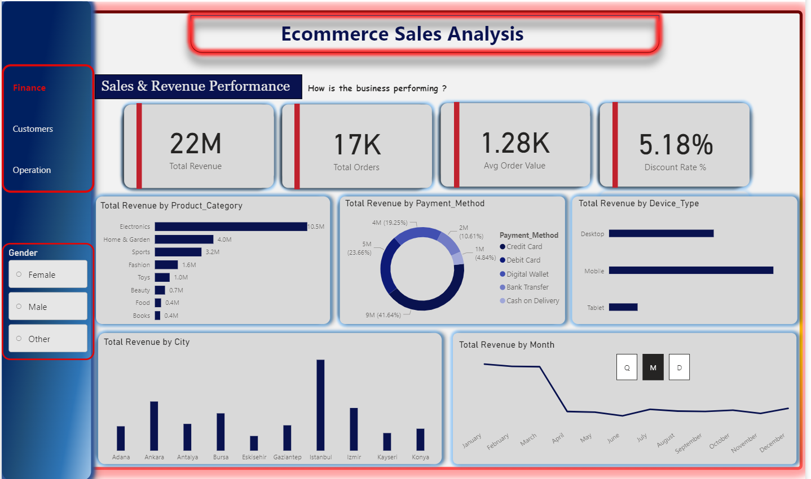

# 🛒 E-Commerce Sales Analysis

> A complete end-to-end Business Intelligence and Machine Learning project analysing e-commerce transactions to uncover revenue insights, customer behaviour patterns, and product recommendations.

[](https://ecommerce-sales-analysis-3lwpkwfdrvuatawhfzg2zm.streamlit.app/)

---

## 🚀 Live Demo

🔗 **[Launch Product Recommendation App](https://ecommerce-sales-analysis-3lwpkwfdrvuatawhfzg2zm.streamlit.app/)**

---

## 📊 Project Overview

This project delivers a full BI solution for an e-commerce business covering **17,049 transactions** across **5,000 customers** from January 2023 to March 2024. The goal was to answer three core business questions:

- **How is the business performing?** → Sales & Revenue Analysis
- **Who are our customers?** → Customer Behaviour & Segmentation
- **How satisfied are they?** → Operational & Customer Experience

A machine learning powered **Product Recommendation System** was also built and deployed as a live web application.

---

## 📁 Project Structure

```
ecommerce-sales-analysis/
    ├── app.py                          ← Streamlit web application
    ├── customer_recommendations.csv    ← Generated recommendations (5,000 customers)
    ├── requirements.txt                ← Python dependencies
    ├── packages.txt                    ← System dependencies
    ├── .streamlit/
    │       └── config.toml            ← Streamlit theme configuration
    ├── notebooks/
    │       ├── recommendation_system.ipynb   ← ML model development
    │       └── sales_forecasting.ipynb       ← Forecasting analysis
    └── data/
            └── ecommerce_data.xlsx    ← Source dataset
```

---

## 🗂️ Dashboard Pages

### Page 1 — Sales & Revenue Performance
> *"How is the business performing?"*



| Metric | Value |
|--------|-------|
| Total Revenue | ₦22 Million |
| Total Orders | 17,000+ |
| Avg Order Value | ₦1,280 |
| Discount Rate | 5.18% |

**Key Findings:**
- Electronics drives 47.7% of total revenue at ₦10.5M
- Digital Wallet is the most preferred payment method at 41.64%
- Istanbul is the highest revenue generating city
- Revenue peaked in December 2023 at ₦1.586M

---

### Page 2 — Customer Behaviour & Segmentation
> *"Who are our customers and how do they shop?"*


| Metric | Value |
|--------|-------|
| Total Customers | 5,000 |
| Returning Customers | 4,651 |
| Returning Rate | 93.02% |
| Avg Spend Per Customer | ₦4,360 |

**Key Findings:**
- 93.02% customer retention rate — exceptionally high loyalty
- Mobile dominates device usage at 4,300 customers
- 35–44 age group is the largest segment at 1,521 customers
- Browsing depth has minimal effect on order value

---

### Page 3 — Operational & Customer Experience
> *"How satisfied are customers and how efficient is delivery?"*


| Metric | Value |
|--------|-------|
| Avg Customer Rating | 3.90 / 5 |
| Satisfaction Rate | 71.11% |
| Avg Delivery Time | 6.50 days |
| On-Time Delivery | 67.76% |

**Key Findings:**
- Ratings are consistent at 3.9 across all 8 product categories
- Delivery times are stable across cities (6.3–6.6 days)
- On-time delivery rate has room for improvement

---

## 🤖 Product Recommendation System

### How It Works
```
Customer Purchase History
        ↓
Customer-Product Matrix (5,000 × 8)
        ↓
Category Similarity (Cosine Similarity)
        ↓
Top 3 Recommendations per Customer
        ↓
Deployed via Streamlit Web App
```

### Model Evaluation

| Metric | Score | Interpretation |
|--------|-------|----------------|
| Precision | 0.1994 | 20% of recommendations are directly relevant |
| Recall | 0.5492 | System captures 55% of relevant categories |
| F1 Score | 0.2926 | Fair combined performance |
| Coverage | 1.0000 | All 8 categories recommended — perfect |
| Diversity | 0.0106 | 53 unique recommendation combinations |

### Streamlit App Preview


---

## 🛠️ Tech Stack

| Category | Tools |
|----------|-------|
| **Dashboard** | Microsoft Power BI |
| **Data Validation** | SQL |
| **Machine Learning** | Python, Scikit-learn, Pandas, NumPy |
| **Visualisation** | Matplotlib |
| **Web App** | Streamlit |
| **Version Control** | GitHub |
| **Deployment** | Streamlit Cloud |

---

## ⚙️ How to Run Locally

**1. Clone the repository**
```bash
git clone https://github.com/your-username/ecommerce-sales-analysis.git
cd ecommerce-sales-analysis
```

**2. Install dependencies**
```bash
pip install -r requirements.txt
```

**3. Run the Streamlit app**
```bash
streamlit run app.py
```

**4. Open your browser**
```
http://localhost:8501
```

---

## 📈 Key Business Recommendations

1. **Revenue** — Invest heavily in Electronics marketing as it drives nearly 50% of revenue
2. **Customers** — Formalise a loyalty programme to capitalise on the 93% retention rate
3. **Operations** — Reduce average delivery time from 6.5 days to under 5 days
4. **Technology** — Integrate recommendations into email marketing for personalised campaigns

---

## 👤 Author

**Oyewole Jeremiah Oladayo**

[](https://www.linkedin.com/in/oyewole-jeremiah-9711a3231/)

---

## 📄 License

This project is open source and available under the [MIT License](LICENSE).

---

*Built with ❤️ using Python, Power BI & Streamlit*
